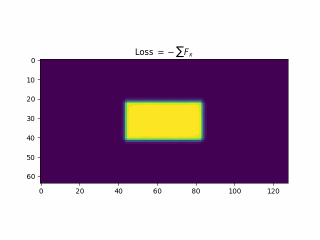

# FluidOptimization
Fluid Topology Optimization using Convolutional Neural Networks and Lattice Boltzmann Simulation  

## Method Overview
The topology optimization algorithm is composed of three components
- Ground truth simulation (Lattice Boltzmann Method) - code not included
- AI fluid force approximation model
- Gradient-based optimization algorithm

## Fluid Force Simulation using Lattice Boltzmann Method (LBM)
Random structures were generated on a cell grid 128x64 and then simulated numerically using the LBM method for the equivalent of 10 seconds in relatively low Reynolds number fluid flows. Data containing average fluid force values in the x and y directions was recorded for each fluid cell along with a total change in force to provide a measure of turbulence ($`\tau`$). 

the force metrics $`F_x`$ and $`F_y`$ are simply averages of lift and drag forces over all simulation steps.

$$F_x = \frac{1}{n} \sum_{t=1}^n U_t$$
$$F_y = \frac{1}{n} \sum_{t=1}^n V_t$$

<!-- $$
\begin{aligned}
a^2 + b^2 &= c^2 \\
x &= y + z
\end{aligned}
$$ -->

The turbulence values represented by ($`\tau`$) were calculated using the following equation

$$F_\tau = \frac{1}{n} \sum_{t=1}^n \sqrt{(U_t - U_{t-1})^2 + (V_t - V_{t-1})^2}$$

Where the force turbulence metric $`F_\tau`$ is the sum of the magnitude of velocity vector changes between simulation steps
- $`U`$ and $`V`$ are fluid force components $`F_x`$ and $`F_y`$, respectively
- $`t`$ some simulation step index in total steps $`n`$

These images display the locations of fluid forces on the boundries of randomly generated solids with the RGB value of each cell reflecting the X,Y and turbulence force values.

## Fluid Force Approximation with a Convolutional Neural Network (CNN)

## Gradient-based optimization algorithm
<!-- 

! -->

The optimization algorithm involves taking topological derivatives and using gradient descent to minimize a loss function.

$$
L\left( F_x,F_y,F_\tau\right)
$$

A loss function can be defined in terms of the outputs of the simulation $`F_x,F_y,`$ and $`F_\tau`$ and thus its derivative can expressed using the chain rule.

$$
\frac{\partial L}{\partial S} = 
\frac{\partial L}{\partial F_x}\frac{\partial F_x}{\partial S}
+ \frac{\partial L}{\partial F_y}\frac{\partial F_y}{\partial S}
+ \frac{\partial L}{\partial F_\tau}\frac{\partial F_\tau}{\partial S}

$$
where $`S`$ is the input state of the cell grid.

These gradients can be approximated by simulating small changes to a shape and evaluating their effects on drag, lift, etc. For example the gradient of drag can be found by simulating a small change $`h`$.

$$
\frac{\Delta F_x}{\Delta S} = \frac{F_x(S+h) - F_x(S)}{h}
$$

Here are a few examples of gradients approximated by changing one cell on a fluid-solid boundry and evaluating using an LBM simulation.

<!-- $$\frac{\partial F_x}{\partial S}$$ -->

Gradients of drag ($`F_x`$) on circle boundry

Gradients of lift ($`F_y`$) on circle boundry

Gradients of turbulence ($`F_\tau`$) on circle boundry

This proccess can be made much more efficient by substituting the costly simulation for a the Nueral Network approximation. This allows the algorithm to compute gradients simbolically using backpropogation.

